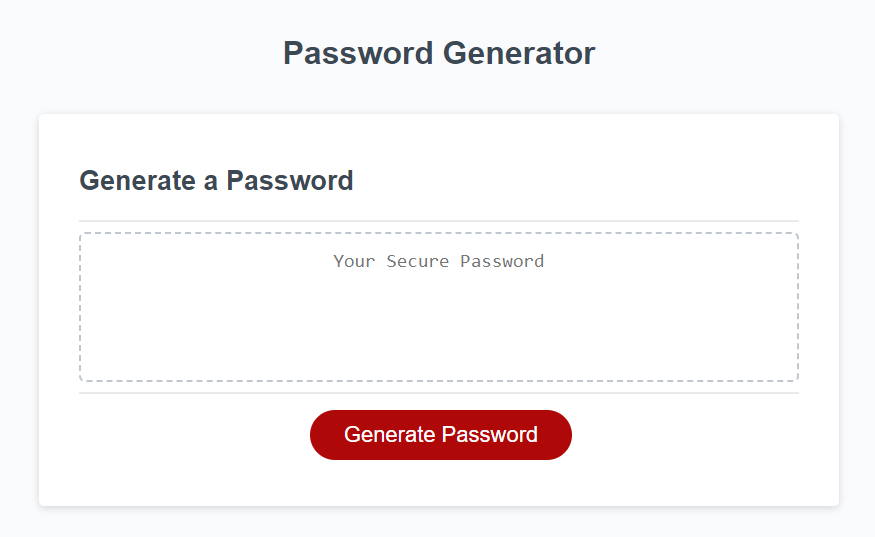
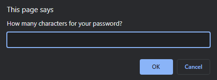
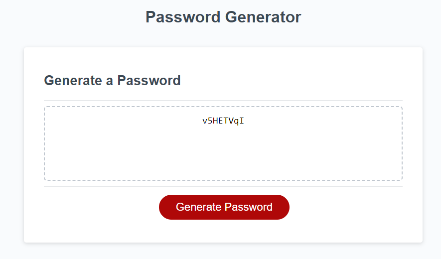

# Random Password Generator

## A simple website for generating random passwords

Access the live site [here](luckysal.github.io/homework-3)

### Usage
To use the site, click the "Generate Password" button. This will bring up a prompt:

Type a number between 8 and 128 (inclusive) to set the desired length of your password.

The next few prompts will ask if you want to use lowercase, uppercase, numeric and [special](https://owasp.org/www-community/password-special-characters) characters. Click on "OK" to add them, or "Cancel" to exclude them.

Finally, the new, random password should appear in the text box:

You can highlight the password with your mouse, then copy and paste it elsewhere.

**Warning**: Make sure to save your new password somewhere! I am not liable for forgotten passwords.